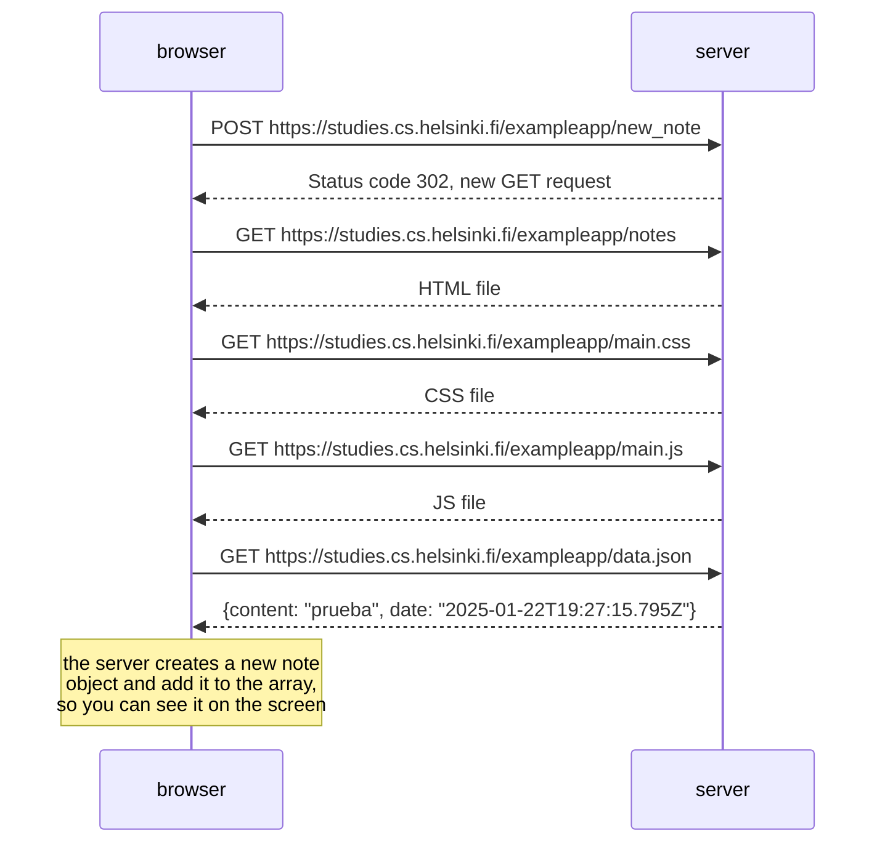

```mermaid
sequenceDiagram
    participant browser
    participant server
    
    browser->>server: POST https://studies.cs.helsinki.fi/exampleapp/new_note
    server -->>browser: Status code 302, new GET request
    browser->>server: GET https://studies.cs.helsinki.fi/exampleapp/notes
    server -->>browser: HTML file
    browser->>server: GET https://studies.cs.helsinki.fi/exampleapp/main.css
    server -->>browser: CSS file
    browser->>server: GET https://studies.cs.helsinki.fi/exampleapp/main.js
    server -->>browser: JS file
    browser->>server: GET https://studies.cs.helsinki.fi/exampleapp/data.json
    server -->>browser: {content: "prueba", date: "2025-01-22T19:27:15.795Z"}
    Note over browser: the server creates a new note <br> object and add it to the array,<br> so you can see it on the screen
```