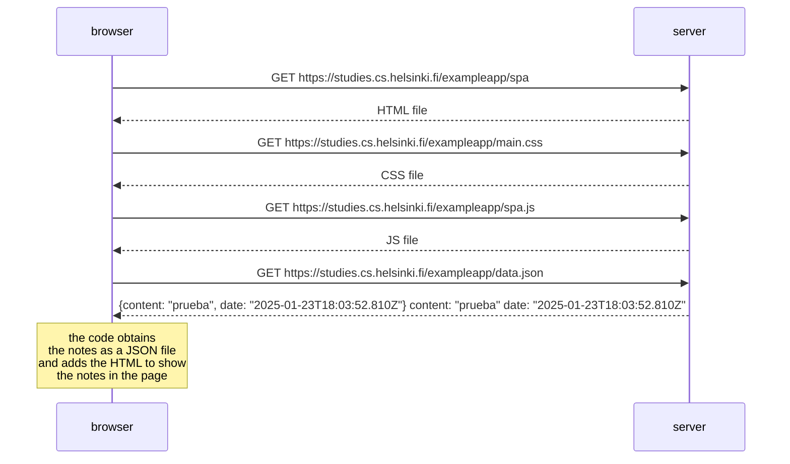

```mermaid
sequenceDiagram
    participant browser
    participant server
    
    
    browser->>server: GET https://studies.cs.helsinki.fi/exampleapp/spa
    
    server -->>browser: HTML file
    browser->>server: GET https://studies.cs.helsinki.fi/exampleapp/main.css
    server -->>browser: CSS file
    browser->>server: GET https://studies.cs.helsinki.fi/exampleapp/spa.js
    server -->>browser: JS file
    browser->>server: GET https://studies.cs.helsinki.fi/exampleapp/data.json
    server -->>browser: {content: "prueba", date: "2025-01-23T18:03:52.810Z"} content: "prueba" date: "2025-01-23T18:03:52.810Z"
    Note over browser:the code obtains <br> the notes as a JSON file <br> and adds the HTML to show <br> the notes in the page
``` 