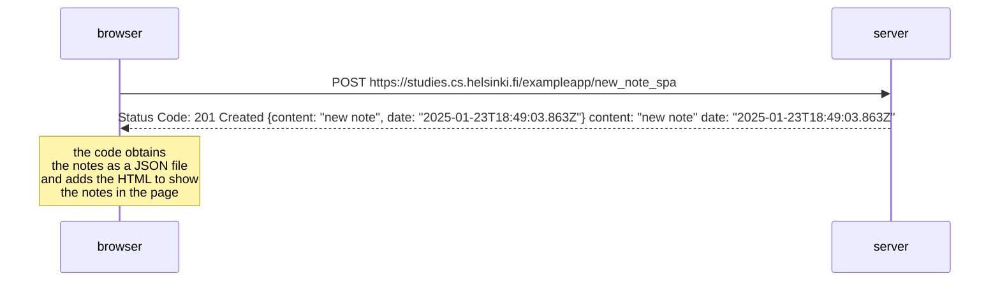

```mermaid
sequenceDiagram
    participant browser
    participant server
    
    
    browser->>server: POST https://studies.cs.helsinki.fi/exampleapp/new_note_spa
    server -->>browser: Status Code: 201 Created {content: "new note", date: "2025-01-23T18:49:03.863Z"} content: "new note" date: "2025-01-23T18:49:03.863Z"
    Note over browser:the code obtains <br> the notes as a JSON file <br> and adds the HTML to show <br> the notes in the page
``` 